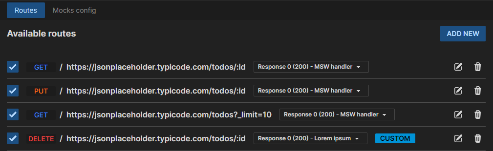
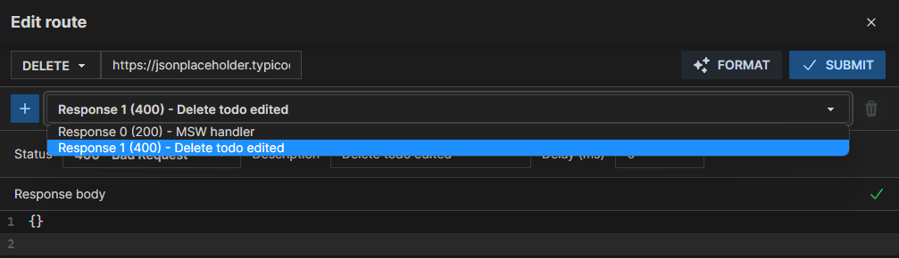
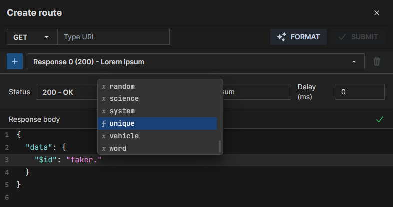

<br />

<p align="center">
  
</p>

<h1 align="center">Mock Service Worker Developer Tools Extension</h1>
<p align="center"><strong>MSW DevTool</strong> is a Chrome Developer Tools extension for debugging and configuring Mock Service Worker in your application.</p>

<br />

<p align="center">
    
</p>

## 🚧 This project is currently in early development 🚧

## Features

✅ **Integrate existing handlers from your application code**.

Once the extension is configured, you will be able to retrieve automatically the list of your configured handlers
in order to activate/deactivate them, editing the responses at runtime and more.



✅ **Create and edit existing handlers on the fly**.

You can edit your handler response at runtime, with the possibility to add more custom responses to choose the one that
suits better your scenario.



✅ **JSON Editor and @faker-js/faker-js integration**.

You can add a custom response body in JSON taking advantage of different custom
features like `Prettier` auto-formatting, autocompleting for `@faker-js/faker-js` variables.



## Usage

```ts
import {setupWorker, SetupWorkerApi} from "msw";
import {handlers} from "./handlers";

export const worker = setupWorker(...handlers);

declare global {
  interface Window {
    __MSWJS_DEVTOOLS_EXTENSION: {
      configure: (msw: SetupWorkerApi) => void;
    };
  }
}

if (window.__MSWJS_DEVTOOLS_EXTENSION) {
  window.__MSWJS_DEVTOOLS_EXTENSION.configure(worker);
}
```

## Roadmap

- [ ] Add handler CRUD
- [ ] Add scenarios
- [ ] Add Import/Export configuration
- [ ] Add configuration persistence
- [ ] Add request conditions from UI
- [ ] Import interfaces from open-api
- [ ] Handle mock environments
- [ ] Add docs
- [ ] Remove tailwind
