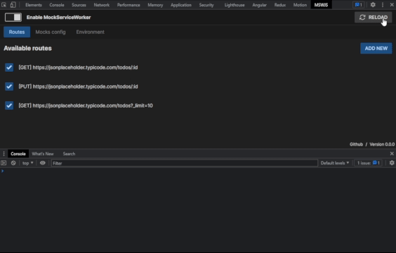

<br />

<p align="center">
  
</p>

<h1 align="center">Mock Service Worker Developer Tools Extension</h1>
<p align="center"><strong>MSW DevTool</strong> is a Chrome Developer Tools extension for debugging and configuring Mock Service Worker in your application.</p>

<br />

<p align="center">
    
</p>

## 🚧 This project is currently in early development 🚧

## Usage

```ts
import {setupWorker, SetupWorkerApi} from "msw";
import {handlers} from "./handlers";

export const worker = setupWorker(...handlers);

declare global {
  interface Window {
    __MSWJS_DEVTOOLS_EXTENSION: {
      configure: (msw: SetupWorkerApi) => void;
    };
  }
}

if (window.__MSWJS_DEVTOOLS_EXTENSION) {
  window.__MSWJS_DEVTOOLS_EXTENSION.configure(worker);
}
```

## Roadmap

- [ ] Add handler CRUD
- [ ] Add scenarios
- [ ] Add Import/Export configuration
- [ ] Add configuration persistence 
- [ ] Add request conditions from UI
- [ ] Import interfaces from open-api 
- [ ] Handle mock environments 
- [ ] Add docs
- [ ] Remove tailwind

Those templates dependencies are maintained via [pnpm](https://pnpm.io) via `pnpm up -Lri`.

This is the reason you see a `pnpm-lock.yaml`. That being said, any package manager will work. This file can be safely
be removed once you clone a template.

```bash
$ npm install # or pnpm install or yarn install
```

### Learn more on the [Solid Website](https://solidjs.com) and come chat with us on our [Discord](https://discord.com/invite/solidjs)

## Available Scripts

In the project directory, you can run:

### `npm dev` or `npm start`

Runs the app in the development mode.<br>
Open [http://localhost:3000](http://localhost:3000) to view it in the browser.

The page will reload if you make edits.<br>

### `npm run build`

Builds the app for production to the `dist` folder.<br>
It correctly bundles Solid in production mode and optimizes the build for the best performance.

The build is minified and the filenames include the hashes.<br>
Your app is ready to be deployed!

## Deployment

You can deploy the `dist` folder to any static host provider (netlify, surge, now, etc.)
